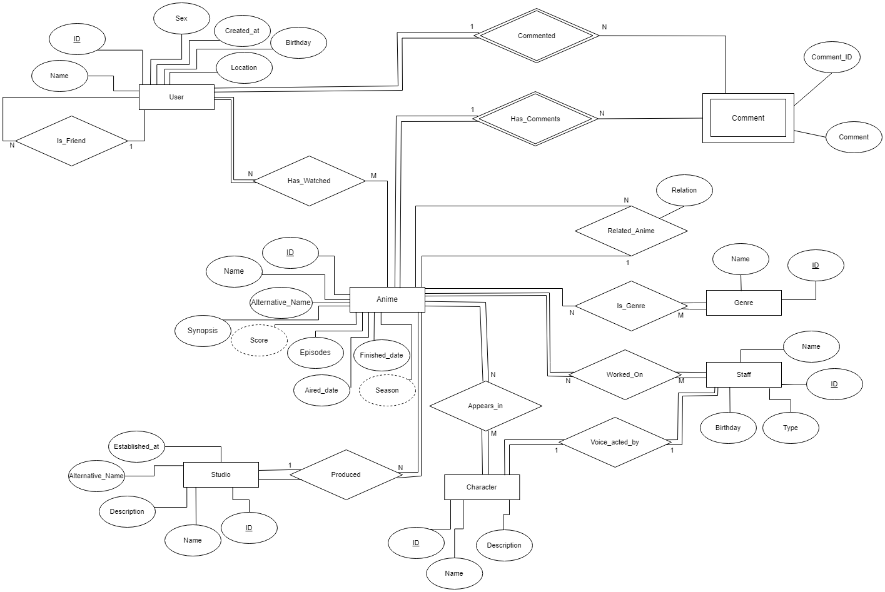
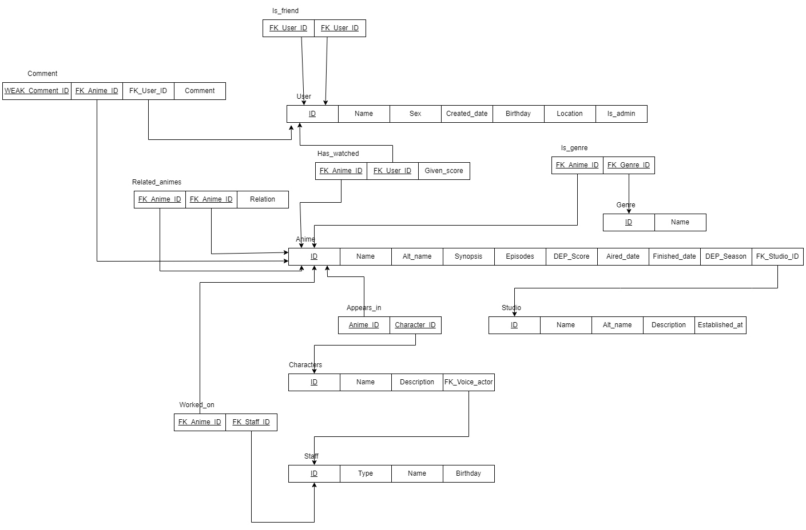

# BD: Trabalho Prático APF-T

  

**Grupo**: P4G4

- Alexandre Miguel Rodrigues Cotorobai, MEC: 107849

- Bernardo Miguel Madeira de Figueiredo, MEC: 108073

  
---
<br>

## Introdução / Introduction

<br>
A ideia para este projeto surgiu devido ao grande interesse de ambos na área dos animes assim como a popularidade dos mesmos.

A nossa implementação permite ao utilizador pesquisar sobre diferentes Animes, personagens, estúdios, entre outros.

Através desta base de dados de Animes, os usuários poderão ter acesso a detalhes sobre os Animes disponíveis, como títulos, gêneros, sinopses, datas de lançamento, staff participante, dubladores, estúdios de animação, entre outros. Além disso, a plataforma permitirá que os usuários compartilhem suas opiniões e avaliações.

A base de dados também terá informações detalhadas sobre as personagens dos Animes, incluindo 
seus nomes, biografias e imagens.

Além disso, a plataforma poderá permitir que os usuários criem perfis personalizados, adicionem outros utilizadores à lista de amigos e façam recomendações e avaliações.

---------------------/ OR /---------------------------

No âmbito da unidade curricular de Base de Dados, foi-nos proposto a criação de uma base de dados com o objetivo de aplicar os conhecimentos adquiridos em aula e apresentá-los numa interface gráfica também criada por nós. 

A ideia para este projeto surgiu do grande interesse de ambos os membros do grupo na área dos animes. Temos o objetivo de apresentar uma interface onde se mostre a informação contida na base de dados de forma organizada e segundo as necessidades do utilizador. 

A plataforma tem dois tipos de utilizadores, utilizador com permissões normais e utilizador com permissões de administrador, onde ambos dispõem da interface para interagir com a base de dados. 

Cada utilizador tem a possibilidade de alterar os detalhes que dizem respeito a si mesmos (detalhes de utilizador, lista vistos, atribuição de score, lista de amigos, etc.), assim como escolher a informação que deseja que lhe seja mostrada (filtros), sendo as permissões de deletar, atualizar e adicionar outras entidades (Anime, Studio, Character, Staff, etc.) restringidas a apenas administradores. 

Com este relatório pretendemos expor todo o trabalho aqui desenvolvido. 
<br>

## ​Análise de Requisitos / Requirements
| Entidade | Funcionalidade |
| -------- | -------------- |
| User     | * Alterar certa infromação de si mesmo<br> * Adicionar anime como visto <br> * Classificar anime <br> * Adicionar amigo <br> *     Adicionar comentário ao anime  <br> * Pesquisar e filtrar as várias tabelas (Anime, Staff, Characters, Studio, etc.) 
| Admin    | * Todas a funcionalidades do User <br> * Adicionar à base de dados novos Animes, Characters, Staffs, Studios, etc.  <br>* Atualizar informações das instâncias de entidades <br> * Apagar qualquer instância

<br>

## DER - Diagrama Entidade Relacionamento/Entity Relationship Diagram

<br>

### Versão final/Final version

  



  

### APFE

<br>

Adição do atributito "Relation" á entidade "Related_Anime" que permite ver que tipo de relação que o anime tem com outro anime, esta relação é uma String que pode tomar qualquer valor e cai aos Admins para inserirem valores uteís pois existem demasiados tipos para implementar de forma concisa.  

Correção de erros que estavam presentes no diagrama inicial, como algumas linhas entre atributos e entidades estarem ausentes.  

Atributo "Image" foi removido de todas as entidades que o tinham ("User", "Anime", "Staff", "Character", "Studio") e "Hashed_password" do "User".  

<br> 

## ER - Esquema Relacional/Relational Schema

<br>

### Versão final/Final Version

  



  

### APFE

<br>

Foram efetuadas mudanças de acordo com as mudanças do DER.

<br>
  

## ​SQL DDL - Data Definition Language

  

[SQL DDL File](sql/01_ddl.sql "SQLFileQuestion")

  

## SQL DML - Data Manipulation Language
  
### Anime


  

```sql

-- Show data on the form

SELECT * FROM MY_TABLE ....;

  

-- Insert new element

INSERT INTO MY_TABLE ....;

```

  

...

  

## Normalização/Normalization

  
Em relação à normalização da nossa base de dados, podemos afirmar que as relações não possuem nem atributos multivalor nem “Nested Relations” cumprindo a 1FN. Só existem dependências totais, cumprindo assim a 2FN e também não existem dependências funcionais entre atributos não chave (3FN).

Concluindo-se assim que foram respeitadas todas as regras de modo a obter-se a Terceira Forma Normal (3FN). 
  

## Índices/Indexes

[SQL Indexes](sql/indexes.sql "SQLFileQuestion")

Analisando as consultas à base de dados, concluímos que criando indices para alguns campos usados para filtrar informação seria bastante benéfico. 

Como no caso do Anime, visto usar-se muito os filtros por nome e aired_date, criar indexes para esse atributo aumenta a performance na pesquisa. 
Outros atributos como no caso do sex nos Users, visto ser muito geral não traz grandes benefícios do ponto de vista de performance.


```sql
-- Create indexes for Anime table
CREATE INDEX IX_Anime_Name ON Anime (Name);
CREATE INDEX IX_Anime_Aired_date ON Anime (Aired_date);

-- Create indexes for Characters table
CREATE INDEX IX_Characters_Name ON Characters (Name);

-- Create indexes for Studios table
CREATE INDEX IX_Studio_Name ON Studio (Name);
CREATE INDEX IX_Studio_Established_at ON Studio (Established_at);

-- Create indexes for Staff table
CREATE INDEX IX_Staff_Name ON Staff (Name);
CREATE INDEX IX_Staff_Type ON Staff ([Type]);

-- Create indexes for Users table
CREATE INDEX IX_Users_Name ON Users (Name);
CREATE INDEX IX_Users_Birthday ON Users (Birthday);
CREATE INDEX IX_Users_Created_date ON Users (Created_date);

```

## SQL Programming: Stored Procedures, Triggers, UDF

[SQL SPs and Functions File](sql/02_sp_functions.sql "SQLFileQuestion")

Foi através de Stored Procedures que fizemos a maior parte das chamadas à Base de Dados, pois são bem mais versáteis e suprimem a maior parte das necessidades.

Dentre elas, criamos SPs para a criação de novas entradas, assim como para atualizar dados já existentes e também eliminar entradas. 

Para além disso, usamos SPs para nos permitir filtrar os dados desejados (também incluímos paginação aos dados), como se segue no exemplo abaixo: 

[SQL Triggers File](sql/03_triggers.sql "SQLFileQuestion")

Foram criados sete triggers sendo 5 deles triggers “Instead of delete” para permitir remover qualquer dependência quando se elimina algo na base de dados, seja isso através de também eliminar entidades com referência à entidade eliminada ou colocando a FK que a referencia a NULL. 

Um dos examplos é este trigger que ao eliminar um character também irá eliminar os tuplos da tabela Apears_In em que o mesmo esteja presente. 

```sql
CREATE TRIGGER TR_Character_Delete
ON Characters
INSTEAD OF DELETE
AS
BEGIN
    SET NOCOUNT ON;
     
    -- Delete rows from Appears_in table
    DELETE FROM Appears_in
    WHERE FK_CharacterID IN (SELECT ID FROM deleted);
      
    -- Delete the character from the Characters table
    DELETE FROM Characters
    WHERE ID IN (SELECT ID FROM deleted);
    PRINT 'Character removed successfully.';
  
END;
GO
```

Os outro trigger foi criado com o objetivo de fazer o cálculo do score de cada anime com base no score individual que cada utilizador dá. Assim, este trigger é chamado sempre que existe alguma mudança na tabela Has_Watched alterando o valor do score do anime. 

```sql
CREATE TRIGGER CalculateAnimeScore
    ON Has_Watched
    AFTER INSERT, UPDATE, DELETE
    AS
        IF EXISTS (SELECT * FROM DELETED)
        BEGIN
            DECLARE ID_CURSOR CURSOR FOR SELECT DISTINCT FK_AnimeID FROM DELETED;
        END
        ELSE IF EXISTS (SELECT * FROM INSERTED)
        BEGIN
            DECLARE ID_CURSOR CURSOR FOR SELECT DISTINCT FK_AnimeID FROM INSERTED;
        END;
        ELSE
        BEGIN
            RETURN;
        END;

        DECLARE @FK_AnimeID INT;
        DECLARE @avg_score DECIMAL(3, 1)
        OPEN ID_CURSOR;
        FETCH NEXT FROM ID_CURSOR INTO @FK_AnimeID;
        WHILE  @@FETCH_STATUS = 0
        BEGIN
                
            SET @avg_score = CAST(
                (SELECT AVG(Given_score)
                FROM Has_watched
                WHERE FK_AnimeID = @FK_AnimeID)
                AS DECIMAL (3, 1)
                );
                
            UPDATE Anime
            SET Score = @avg_score
            WHERE ID = @FK_AnimeID;
            
            -- SELECT @FK_AnimeID;
            -- SELECT @avg_score;

            FETCH NEXT FROM ID_CURSOR INTO @FK_AnimeID; 


        END;
        CLOSE ID_CURSOR;
GO
```

E por último também criamos um trigger “After Insert/Update” que permite deduzir a Season com base na data de lançamento.

```sql
CREATE TRIGGER AddSeason
    ON Anime
    AFTER INSERT, UPDATE
    AS
    BEGIN
        UPDATE Anime
        SET Season = CASE 
            WHEN MONTH(Aired_date) IN (12, 1, 2) THEN 'Winter'
            WHEN MONTH(Aired_date) IN (3, 4, 5) THEN 'Spring'
            WHEN MONTH(Aired_date) IN (6, 7, 8) THEN 'Summer'
            WHEN MONTH(Aired_date) IN (9, 10, 11) THEN 'Fall'
            ELSE 'Unknown'
        END
        WHERE ID IN (SELECT ID FROM inserted);

    END;
GO 
```
[SQL UDFs File](sql/04_udf.sql "SQLFileQuestion")

Devido às suas restrições, apenas achamos pertinente usar uma UDF para a verificação se um user era admin, visto tratar-se de uma operação relativamente simples. 

```sql
CREATE FUNCTION IsAdmin(@UserID int)
RETURNS bit
AS
BEGIN
    DECLARE @IsAdmin bit

    SELECT @IsAdmin = Is_admin
    FROM [Users]
    WHERE ID = @UserID

    
    RETURN @IsAdmin
END;
GO
```

### Dados iniciais da dabase de dados/Database init data

[Insertion Data](sql/05_initialData.sql "SQLFileQuestion")